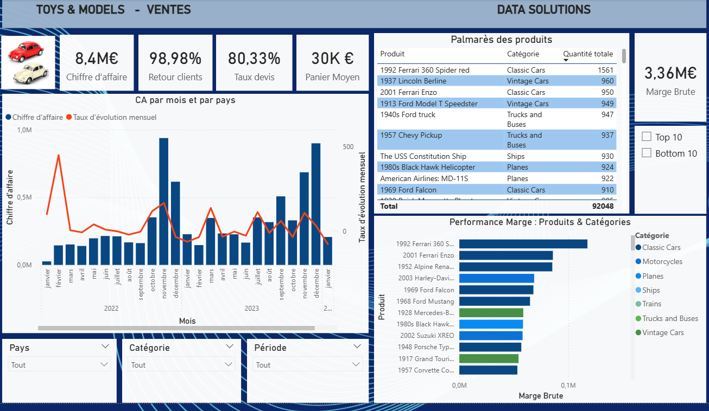
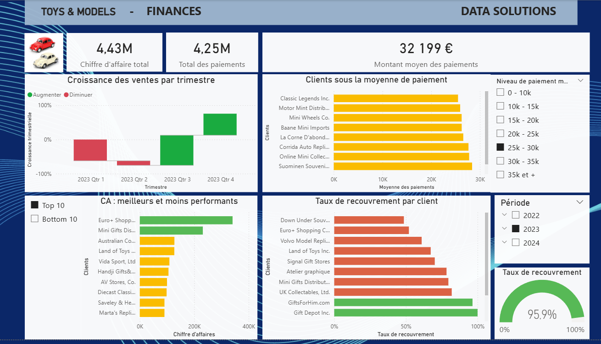
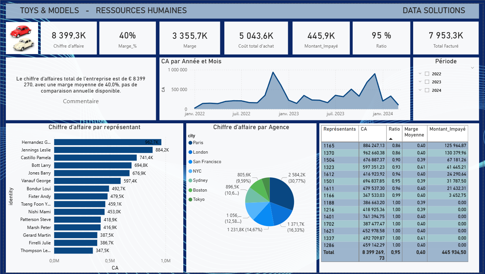

# Toys_and_models

Création d'une solution Business Intelligence complète pour l'entreprise Toys & Models. L'objectif est de transformer des données brutes issues d'une base de données relationnelle en indicateurs clés de performance (KPI) actionnables pour trois départements majeurs : **Ventes, Finances et Ressources Humaines**.

---

## 🔗 Toys & Models - Dashboard décisionnel 360°

### Présentation du projet
Ce projet consiste en la création d'une solution de **Business Intelligence** complète pour l'entreprise "Toys & Models", un distributeur mondial de modèles réduits. L'objectif est de transformer des données brutes extraites d'une base de données MySQL en indicateurs clés de performance (KPI) pour piloter les trois piliers de l'entreprise.

### Périmètre de l'analyse

#### Dashboard ventes (Sales)
* **Suivi de la performance :** Analyse du chiffre d'affaires mensuel par bureau et par région.
* **Fidélisation :** Calcul du taux de retour des clients pour identifier les acheteurs réguliers.
* **Efficacité commerciale :** Analyse du panier moyen et de l'évolution des ventes par catégorie de produits.

#### Dashboard finance
* **Rentabilité :** Calcul précis de la marge brute par produit et par ligne de produits.
* **Trésorerie :** Suivi de la croissance des ventes par trimestre et analyse du montant moyen des paiements.
* **Gestion des créances :** Identification des retards de paiement et calcul du taux de recouvrement par client.

#### Dashboard RH
* **Performance individuelle :** Classement des représentants commerciaux selon le chiffre d'affaires généré.
* **Gestion des impayés :** Calcul du ratio commandes/paiements par représentant pour responsabiliser les commerciaux sur le recouvrement client.
* **Logistique interne :** Analyse du délai moyen de traitement des commandes et du taux de livraison en retard.

---

## 🛠️ Stack technique

* **Base de données :** MySQL (Requêtage complexe, CTE, et fonctions de fenêtrage).
* **ETL :** Power Query pour le nettoyage et la structuration des données.
* **Modélisation :** DAX pour la création de mesures dynamiques.
* **Visualisation :** Power BI Desktop (Rapports interactifs : Ventes, Finances, RH).

---

## 🔍 Expertise SQL (Exemple d'analyse)

L'intelligence des rapports provient de scripts SQL optimisés. L'intégralité des requêtes est disponible dans le fichier `sql/Queries_DataSolutions.sql`.

**Exemple : Calcul du ratio d'impayés par représentant commercial**

```sql
SELECT 
    rpe.salesRepEmployeeNumber AS 'Id employee',
    rpe.Name,
    SUM(payment.amount) AS 'Total payments',
    SUM(rpe.Revenue_employee) AS 'Revenue per employee',
    SUM(rpe.Revenue_employee) - SUM(payment.amount) AS 'Difference revenue',
    CONCAT(ROUND(((SUM(rpe.Revenue_employee) - SUM(payment.amount))/SUM(rpe.Revenue_employee))*100, 2), '%') AS 'Unpaid Ratio'
FROM (
    SELECT 
        e.employeeNumber AS salesRepEmployeeNumber,
        c.customerNumber,
        CONCAT(e.lastName, ' ', e.firstName) AS Name,
        SUM(od.priceEach * od.quantityOrdered) AS Revenue_employee
    FROM customers c
    LEFT JOIN orders o ON o.customerNumber = c.customerNumber
    LEFT JOIN orderdetails od ON o.orderNumber = od.orderNumber
    LEFT JOIN employees e ON e.employeeNumber = c.salesRepEmployeeNumber
    GROUP BY e.employeeNumber, c.customerNumber, e.lastName, e.firstName
) AS rpe
LEFT JOIN (
    SELECT 
        cu.salesRepEmployeeNumber,
        cu.customerNumber,
        SUM(p.amount) AS Payment
    FROM customers cu
    LEFT JOIN payments p ON p.customerNumber = cu.customerNumber
    GROUP BY cu.salesRepEmployeeNumber, cu.customerNumber
) AS payment ON payment.customerNumber = rpe.customerNumber
GROUP BY rpe.salesRepEmployeeNumber, rpe.Name
ORDER BY ((SUM(rpe.Revenue_employee) - SUM(payment.amount))/SUM(rpe.Revenue_employee))*100 DESC;
```

---

## 🏗️ Modélisation des Données : Schéma en Étoile

Pour garantir des performances optimales et une clarté analytique, les données ont été restructurées selon un **Schéma en Étoile (Star Schema)**.

* **Table de Faits :** Centralisation des transactions (`FACT_ORDER`) et des montants (`FACT_AMOUNT`).
* **Dimensions :** Restructuration des tables pour les produits (`DIM_PRODUCT`), clients (`DIM_CUSTOMER`), agences (`DIM_AGENCY`) et l'intégration d'une dimension temps (`DIM_DATE`).

---

## 🖼️ Aperçu des Dashboards

### Vue Ventes

*Analyse du chiffre d'affaires mensuel, du panier moyen et du taux de retour client.*

### Vue Finances

*Suivi de la croissance trimestrielle, des taux de recouvrement et des délais de paiement.*

### Vue Ressources Humaines

*Visualisation de la performance des représentants et du ratio commandes/paiements par agent.*

---

## 📂 Structure du Dépôt

* 📁 **sql/** : Contient le script `Queries_DataSolutions.sql` regroupant toutes les analyses métier.
* 📁 **Images/** : Captures d'écran des rapports Power BI (`Ventes.jpg`, `Finances.jpg`, `RH.jpg`).
* 📄 **Ventes.pbix, Finances.pbix, RH.pbix** : Fichiers sources Power BI.
